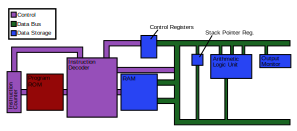

# Minimalist CPU and Compiler Collection
The **MCCC** was created as a teaching tool to show an entire hardware to high-level(relatively) programming language stack and how everything fits together. Instead of talking about memory in abstract terms and just the concepts of binary machine code, the MCCC allows you to see the memory change in front of you -- and due to its simplicity -- easily understand all of the machine code that makes up a program. In order to fully cover every step that goes into running a compiled language, even a simplified one, the MCCC is made up of several different components:
1. A **16-bit minimalist CPU** built inside of [Logism Evolution](https://github.com/reds-heig/logisim-evolution), a digital logic simulator
1. A **simplistic assembly language** built specifically for that CPU
1. A **cross-assembler** written in C++ which outputs ROMs that Logism Evolution can directly read
1. A **higher level language** with simplistic and familiar C-looking syntax.
1. A **compiler and linker** built for that language in C++ which creates working assembly programs
1. A **debugger** for the CPU which can emulate its processes while giving a full RAM-dump and call stack readout

The debugger is particuarly useful for teaching as it provides an annotated readout of RAM through the call stack, which allows a more full understanding of how the call stack really works. For example: Newer programmers tend to have some difficulty understanding how recursion works, and for this reason the MCCC comes with an example factorial program that evaluates resursively. When running it through the debugger, the way a CPU goes about evaluating it becomes very clear.

## Build Chain Overview

The basic build chain is very similiar to that of a real compiler, though there are some differences.

The ideas are all still there though:
1. The "high-level" code is written in a series of files denoted by a ".sym" extension.
1. These files are all thrown into the compiler and for each of them comes out a ".asm" file. These files are now written in MCCC assembly. The compiler does put in some extra "context" tags for use in debugging and to aid in reading, but they will ignored by the assembler and are discarded afterwards.
1. After all of the ".asm" files have been produced, they can all be "linked" together into one ".asm.out" file. This file has no syntactic difference between a normal ".asm" file, the ".out" is merely there to denote that it is a finished executable file and so will actually do what the original high-level program specified.
1. Once the ".asm.out" file has been created it can be given to the assembler and turned into a ".rom" file. This file is in a format used by [Logism Evolution](https://github.com/reds-heig/logisim-evolution) and if you right click on the ROM chip on the cpu and press the "Load Image" option, you can load it directly into the CPU and run your program.

It is important to point out that any of these files can be written by hand and you don't need to start with a ".sym" file. If you want to write your own assembly you can easily write a ".asm" file and use the assembler to get the machine code and run it.

Below are written explanations on all of the file formats used(".sym", ".asm", and ".rom") and the syntax of the language they contain.

### Symbolic Language -- ".sym" Files
These are "high-level" program source code files. The syntax is similiar enough that anyone familiar with C, C++, or anything similiar to them should be able to read it. But, and this is important to remember, they are not at all C. The language's features been stripped to the minimum and the vast majority of things in C are not valid in the slightest in MCCC symbolic code. Despite this, it is still possible to write programs that achieve relatively complex tasks and because of the limited syntax the language can be learned extremely quickly.

When writing MCCC symbolic programs, there is a similiar system of header files and source files as in C. So, to denote that something is a header file the extension ".h.sym" is used. For source files a simple ".sym" is used. It's important to mention that there is no need for header guards though as the compiler takes care of those for you.

[Syntax Explanation](explanations/symbolic.sym)

### Assembly Language -- ".asm" Files
MCCC assembly is 1 to 1 with MCCC machine code: every statement in the .asm file becomes one instruction to the CPU. This does not mean that it is machine code, though, as there are more than just statements. The biggest is that you can make "goto" destinations and sources that will automatically link up to eachother. There are also "context" tags that are used by the debugger to show information about what the CPU is doing. Both of these are discarded once the ".asm" is turned into a ".rom" and do not translate into instructions by themselves.

[Syntax Explanation](explanations/assembly.asm)

#### ".asm.out" Files
The ".asm.out" files are the exact same language as the ".asm" files; both are written in MCCC assembly. The change in extension is just to denote that they are a finished executable that can be ran. If you attempt to run a compiled ".sym" file without linking it it will certainly not function correctly. If the file isn't linked it will be missing it's "executable header" which is added by the linker in the final step and tells the cpu to actually call the "main" function. If you want to compile a single file you still have to link it with itself before you can run it or else that "executable header" will be missing.

If you write your own ".asm" file by hand you can just assemble it directly and you don't need to worry about this ".asm.out" step.

### Machine Language -- ".rom" Files
Once the program is assembled into the MCCC machine language it is just completely binary and the CPU's decoding hardware will be able to read and execute it as written. Unlike the other two file formats, the ".rom" format was not created by me and is just the format used by Logism Evolution to read files. 

[Syntax Explanation](explanations/rom.md)

## The CPU Itself
The CPU is constructed out of various basic logic gates, with a few more advanced things like the RAM, ROM, and register chips. The hardware should all be correct and if you built one of these in real life it should function just as intended and be able to execute code. For now though, it lives inside of a [Logism Evolution](https://github.com/reds-heig/logisim-evolution) ".circ" file and you can simulate all of the logic gates and wires in that program. 

This is a 16-bit CPU and it can individually address 2^16 ram addresses and the maximum size for a program is 2^16 instructions. Every RAM address can store a 16-bit number as well, so a single byte can store any value from 0 to 65535.

The basic layout and design of the CPU is summarized in the following diagram:

The instruction counter controls what instructions or sub-instructions are being executed, the instructions are fed from the ROM into the instruction decoder which commands the various components(RAM, registers, data bus, and instruction counter) into doing what they need to do. Sometimes to execute an instruction the instruction decoder will read some values out of the "control registers"(e.g. in order to execute a conditional goto it has to check to see if the condition in registor #0 is true or not). By moving data into, out of, and between the various registers and RAM the instruction decoder can carry out the instructions given to it. This structure is much, much, *much* simplier than a real CPU, but it fills all of the boxes that it needs to. It's important to remember that all of the registers are specalized and they can only carry out one task, unlike a real CPU which might have general purpose registers. For example, all arithmetic is performed by setting various specalized input registers and then reading the output from a specific output register.

A picture of the actual hardware from within Logism Evolution is here:

and an annotated version is here:

You can open these images in a new tab if you want to see them more magnified.

If you have a ROM to load into Logism Evolution, you can just right-click on the ROM chip and press "Load Rom" and select the ".rom" file you want to load. After that you can use the CPU controls in the bottom left of the circuit to actually start the CPU. Remember to have "ticks" enabled and by changing the tick speed you can make the CPU go faster or slower. For any more help with [Logism Evolution](https://github.com/reds-heig/logisim-evolution) you can read its tutorials.

## Actual MCCC Usage
The compiler, linker, assembler, and debugger are all the same executable -- the source of which can be found in the "src" directory.
The basic uses are as follows:
1. `./MCCC --help` will list all valid parameters
1. To compile all of the source files in a directory: `./MCCC compile *.sym`.
1. To link all of those compiled files together: `./MCCC exeLink program.asm.out *.asm`. It's important that the final executable has a ".asm.out" extension or else the `*.asm` wildcard will also include it, which would be bad.
1. To assemble the final program: `./MCCC assemble program.rom program.asm.out`

In addition to the "exeLink" option there is also a "libLink" option which creates another ".asm" file that includes all of the functions of the input files which can then be finally linked with more files using the "exeLink" to create the final executable. This is not particuarily useful, but the option is there.

The final usage is `./MCCC automatedTest` which runs the automated testing suite used for development purposes. It runs several test ".asm" and ".sym" files on the debugger and checks to make sure they are functioning correctly.

## Debugger
The final useable of the MCCC executable is for the debugger. The debugger can be fed an executable ".asm" or ".asm.out" file like so: `./MCCC debug program.asm.out`. MCCC will then automatically assemble and run the program on an emulated CPU. The advantage of running the program like this is that the host computer can dissect the RAM while the CPU is running and -- because it was given the ".asm" file with the context tags -- piece back together the entire call stack and even exactly what line of the original program it is currently on. It also includes a bunch of other information about the current CPU state.

A screenshot of the debugger while it's running the example "factorial" program is here:

From the inside of the debugger you can actually see the entirety of used RAM from within the call stack and it's usage listed to the right of it.

## Dependencies
The only library it uses outside of the C++ standard library is Boost.Spirit for parsing, which is itself dependent on some other Boost libraries. 
In addition to Boost.Spirit it is also dependent on [Logism Evolution](https://github.com/reds-heig/logisim-evolution) for simulating the CPU's hardware, though MCCC does not need it to compile

